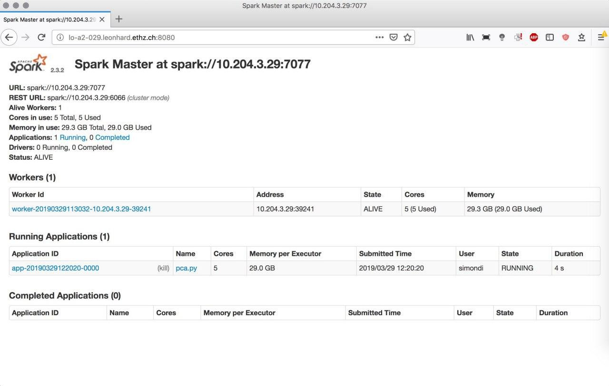

FAQ
===

.. contents::
   :depth: 2
   :local:
   :backlinks: None
   :class: multiple

What's the best way to start using Spark?
.........................................

Apache Spark has a steep learning curve. If you want to use
one of the methods it's recommended, to start with a small data size such that
you can figure out memory requirements or how many compute nodes you will need
to run an algorithm in a specified amount of time. If everything works out, try
increasing the data size until you either encounter errors or everything works
fine.

How can I debug Apache Spark?
.............................

Sometimes jobs might fail, because you launched Spark's compute nodes with too
little memory, or a node lost its connection to the main worker, etc. When
starting a cluster and running a method, it's thus recommended to monitor what
Spark is actually doing. You can do so by first starting a Spark cluster. We
do that here using `spark_hpc <https://github.com/rokroskar/sparkhpc>`__:

.. code-block:: bash

  sparkcluster start --memory-per-executor 30000 \
                     --memory-per-core 5000 \
                     --walltime 4:00 \
                     --cores-per-executor 5 1

Having the cluster started, we can get information to which URL the *Spark UI*
is listening to:

.. code-block:: bash

  spark-cluster info

  > ----- Cluster 0 -----
  > Job id: 1756002
  > Number of cores: 1
  > Status: submitted
  > Spark UI: http://lo-a2-029.leonhard.ethz.ch:8080
  > Spark URL: spark://10.204.3.29:7077

In this case it's `http://lo-a2-029.leonhard.ethz.ch:8080`. The Spark UI can
then be accessed from your desktop computer (by ssh port forwarding):

.. figure:: _static/spark_ui_pre.jpg
   :align: center
   :height: 400px

We then start a PyBDA application and can monitor what Spark is doing:

.. code-block:: bash

  pybda dimension-reduction pca.yml spark://10.204.3.29:7077

We see that Spark started the application and runs it on 5 cores with 29Gb of memory:

How can I debug my config?
..........................

spark-submit on command line with debugs