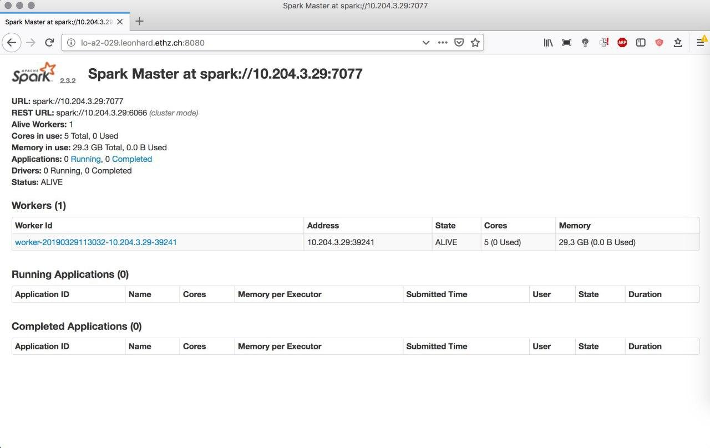

FAQ
===

.. contents::
   :depth: 2
   :local:
   :backlinks: None
   :class: multiple

What's the best way to start using Spark?
.........................................

Apache Spark has a steep learning curve. If you want to use
one of the methods it's recommended to first go through the documentation `here <https://spark.apache.org/docs/latest/>`__.
Then test some applications with small data sizes such that
you can figure out memory requirements or how many compute nodes you will need
to run an algorithm in a specified amount of time. If everything works out, try
increasing the data size until you either encounter errors or everything works
fine.

How can I check Apache Spark is executing correctly?
....................................................

Sometimes jobs might fail, because you launched Spark's compute nodes with too
little memory, or a node lost its connection to the main worker, etc. When
starting a cluster and running a method, it's thus recommended to monitor what
Spark is actually doing. You can do so by first starting a Spark cluster. We
do that here using `spark_hpc <https://github.com/rokroskar/sparkhpc>`__:

.. code-block:: bash

  sparkcluster start --memory-per-executor 30000 \
                     --memory-per-core 5000 \
                     --walltime 4:00 \
                     --cores-per-executor 5 1

Having the cluster started, we can get information to which URL the *Spark UI*
is listening to:

.. code-block:: bash

  spark-cluster info

  > ----- Cluster 0 -----
  > Job id: 1756002
  > Number of cores: 1
  > Status: submitted
  > Spark UI: http://lo-a2-029.leonhard.ethz.ch:8080
  > Spark URL: spark://10.204.3.29:7077

In this case it's ``http://lo-a2-029.leonhard.ethz.ch:8080``. The Spark UI can
then be accessed from your desktop computer (by ssh port forwarding):

We then start a PyBDA application and can monitor what Spark is doing:

.. code-block:: bash

  pybda dimension-reduction pca.yml spark://10.204.3.29:7077

We see that Spark started the application and runs it on 5 cores with 29Gb of memory:

.. figure:: _static/spark_ui_post.jpg
   :align: center
   :width: 800px

How can I debug my config file?
...............................

If PyBDA exits for unkown reasons, it is often due to misspecified file paths,
wrong parameterization, etc. To see how PyBDA starts applications you can add
``debug: true`` to your config file. This will print the Spark commands to stdout.
For instance, we use the following config file:

.. literalinclude:: _static/clustering-example.config
  :caption: Example of a configuration file.

We then call PyBDA using the ``clustering`` subcommand and pipe the output to a
file. Grepping ``spark-submit`` gives us the calls Spark does.

.. code-block:: bash

  pybda clustering clustering-example.config local > job
  grep -i spark-submit job

  > Submitting job spark-submit --master local --driver-memory=3G --executor-memory=6G
  >                             pybda/factor_analysis.py 5
  >                             single_cell_imaging_data.tsv feature_columns.tsv
  >                             results/factor_analysis
  > Submitting job spark-submit --master local --driver-memory=3G --executor-memory=6G
  >                             pybda/kmeans.py 50,100,110,120,130,140,150,160,170,180,190,200
  >                             results/factor_analysis.tsv feature_columns.tsv results/kmeans

The output shows that our application consists of two calls. One being the dimension reduction,
the other being the clustering.

How can I find out what went wrong with the algorithm?
......................................................

Every method or algorithm creates a log file suffixed with ``*.log``. Having a look
at the log should make clear if errors and what kind of errors happened.

How can I find out if snakemake ran properly?
.............................................

Snakemake produces a hidden folder called ``.snakemake/log`` within the directory from
which you call an application. The log files keep track what Snakemake is executing.