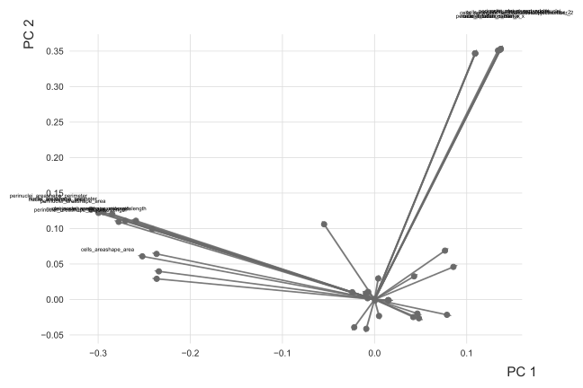
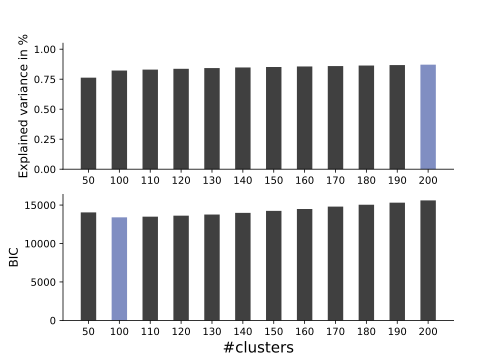
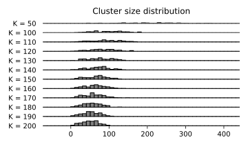

PyBDA
=====

.. image:: http://www.repostatus.org/badges/latest/wip.svg
   :target: http://www.repostatus.org/#wip
   :alt: Status
.. image:: https://img.shields.io/travis/cbg-ethz/pybda/master.svg?&logo=travis
   :target: https://travis-ci.org/cbg-ethz/pybda/
   :alt: Travis
.. image:: https://img.shields.io/circleci/project/github/cbg-ethz/pybda/master.svg?&logo=circleci
   :target: https://circleci.com/gh/cbg-ethz/pybda
   :alt: CircleCI
.. image:: https://codecov.io/gh/cbg-ethz/pybda/branch/master/graph/badge.svg
   :target: https://codecov.io/gh/cbg-ethz/pybda
   :alt: Codecov
.. image:: https://api.codacy.com/project/badge/Grade/a4cca665933a4def9c2cfc88d7bbbeae
   :target: https://www.codacy.com/app/simon-dirmeier/pybda?utm_source=github.com&amp;utm_medium=referral&amp;utm_content=cbg-ethz/pybda&amp;utm_campaign=Badge_Grade
   :alt: Codacy
.. image:: https://readthedocs.org/projects/pybda/badge/?version=latest
   :target: https://pybda.readthedocs.io/en/latest/?badge=latest
   :alt: Documentation
.. image:: https://img.shields.io/badge/install%20with-bioconda-brightgreen.svg?style=flat
   :target: http://bioconda.github.io/recipes/pybda/README.html
   :alt: Bioconda
.. image:: https://img.shields.io/pypi/v/pybda.svg?colorB=black&style=flat
   :target: https://pypi.org/project/pybda/
   :alt: PyPi

A commandline tool for analysis of big biological data sets for distributed HPC clusters.

.. toctree::
   :hidden:
   :maxdepth: 1
   :titlesonly:

   Home <self>
   usage
   examples
   faq
   contributing

About
-----

Welcome to PyBDA.

PyBDA is a Python library and command line tool for big data analytics and machine learning.

In order to make PyBDA scale to big data sets, we use Apache [Spark]_'s DataFrame API which, if developed against, automatically distributes
data to the nodes of a high-performance cluster and does the computation of expensive machine learning tasks in parallel.
For scheduling, PyBDA uses [Snakemake]_ to automatically execute pipelines of jobs. In particular, PyBDA will first build a DAG of methods/jobs
you want to execute in succession (e.g. dimensionality reduction into clustering) and then compute every method by traversing the DAG.
In the case of a successful computation of a job, PyBDA will write results and plots, and create some statistics. If one of the jobs fails PyBDA will report where and which method failed
(owing to Snakemake's scheduling) such that the same pipeline can effortlessly be continued from where it failed the last time.

PyBDA supports multiple machine learning methods that scale to big data sets which we either implemented from scratch entirely or interface the methodology from [MLLib]_:

* dimensionality reduction using PCA, factor analysis, kPCA, linear discriminant analysis and ICA,
* clustering using k-means and Gaussian mixture models,
* supervised learning using generalized linear regression models, random forests and gradient boosting.

The package is actively developed. If you want to you can also contribute, for instance by adding new features or methods:
`fork us on GitHub <https://github.com/cbg-ethz/pybda>`__.

Dependencies
------------

* Apache Spark == 2.4.0
* Python == 3.6
* Linux or MacOS

Example
-------

To run PyBDA you only need to provide a config-file and, if possible, the IP of a spark-cluster (otherwise you can just call PyBDA locally using ``local``).
The config file for several machine learning tasks might look like this:

.. literalinclude:: _static/pybda-usecase.config
  :caption: Example of a configuration file.
  :name: pybda-usecase.config

The above configuration would tell PyBDA to execute multiple things:

* first use an PCA to embed the data into a 5-dimensional latent space,
* do a ``k``-means clustering with different numbers of clusters centers on that space,
* fit a random forest to the response called ``is_infected`` and use a ``binomial`` family,
* give the Spark driver 3Gb of memory and the executor 6Gb,
* print debug information.

You call PyBDA like that:

.. code-block:: bash

   pybda run data/pybda-usecase.config local

where ``local`` tells PyBDA to just use your desktop as Spark cluster.

The result of any PyBDA call creates several files and figures. For instance, we
should check the performance of the forest:

.. literalinclude:: _static/forest-statistics.tsv
   :caption: Performance statistics of the random forest.
   :name: rf.tsv

For the PCA, we for instance create a biplot. It's always informative to look at these:

   PCA biplot of the single-cell imaging data.

And for the consecutive clustering, two of the plots generated from the clustering are shown below:

   Number of clusters vs explained variance and BIC.

   Distribution of the number of cells per cluster (component).

References
----------

.. [Snakemake] `Köster, Johannes, and Sven Rahmann. "Snakemake—a scalable bioinformatics workflow engine." Bioinformatics 28.19 (2012): 2520-2522. <https://doi.org/10.1093/bioinformatics/bts480>`_
.. [Spark]     `Zaharia, Matei, et al. "Apache Sspark: a unified engine for big data processing." Communications of the ACM 59.11 (2016): 56-65. <https://doi.org/10.1145/2934664>`_
.. [MLLib]     `Meng, Xiangrui, et al. "MLlib: Machine Learning in Apache Spark." The Journal of Machine Learning Research 17.1 (2016): 1235-1241. <http://jmlr.org/papers/volume17/15-237/15-237.pdf>`_
