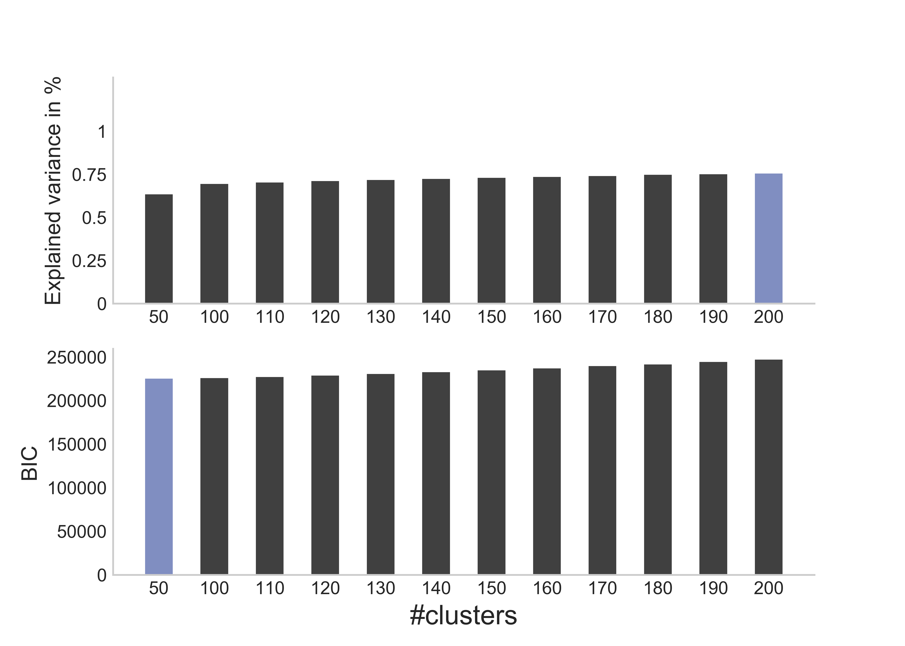
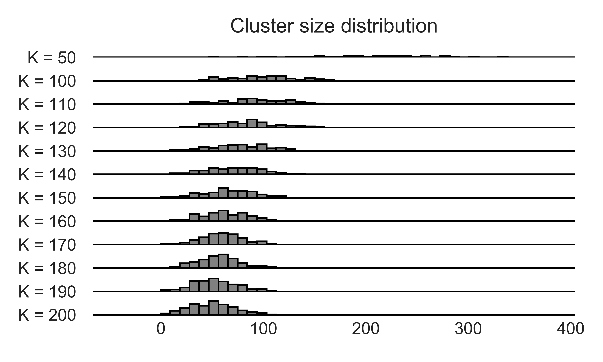

Κοῖος /ˈci.os/
==============

.. image:: http://www.repostatus.org/badges/latest/active.svg
   :target: http://www.repostatus.org/#active
.. image:: https://travis-ci.org/cbg-ethz/koios.svg?branch=master
   :target: https://travis-ci.org/cbg-ethz/koios/
.. image:: https://codecov.io/gh/cbg-ethz/koios/branch/master/graph/badge.svg
   :target: https://codecov.io/gh/cbg-ethz/koios/
.. image:: https://api.codacy.com/project/badge/Grade/1822ba83768d4d7389ba667a9c839638
   :target: https://www.codacy.com/app/simon-dirmeier/rnaiutilities_2?utm_source=github.com&amp;utm_medium=referral&amp;utm_content=cbg-ethz/rnaiutilities&amp;utm_campaign=Badge_Grade
.. image:: https://readthedocs.org/projects/koios/badge/?version=latest
   :target: http://koios.readthedocs.io/en/latest/
   :alt: doc

A command line tool for big data analytics and machine learning using Apache Spark and Snakemake.

.. toctree::
   :hidden:
   :maxdepth: 2
   :titlesonly:

   Home <self>
   usage
   usecase_dimred
   usecase_clustering
   usecase_regression

About
-----

Welcome to ``koios``.

``koios`` is a Python command line tool for analysis of big biological data sets.
It supports machine learning for big data sets that scale up to tera byte sizes.
``koios`` uses Apache Spark's DataFrame API and MLLib which, if developed against, automatically distributes
data to the nodes of a high-performance cluster and does the computations
in parallel. In addition we use Snakemake to automatically schedule pipelines of jobs.

Sofar ``koios`` supports

* dimensionality reduction using PCA, factor analysis and kPCA,
* clustering using k-means and Gaussian mixture models,
* supervised learning using generalized linear regression models, random forests and gradient boosting.

The library is actively developed and will add new features in a timely fashion. If you want to you can also contribute:
`fork us on GitHub <https://github.com/cbg-ethz/biospark>`_.

Dependencies
------------

* Apache Spark >= 2.3.0
* Python >= 3.6

Example
-------

``koios`` only requires a config-file and, if possible, the IP of a spark-cluster. Otherwise you can just call koios locally using ``local``).
The config file might for a simple clustering case look like this:

.. literalinclude:: ../../koios-usecase-kmeans.config
  :caption: Contents of ``koios-usecase-kmeans.config`` file
  :name: koios-usecase-gmm.config

This would fight several k-means clusterings with different numbers of clusters.
Calling the tool is then as simple as:

.. code-block:: bash

   koios clustering koios-usecase-kmeans.config local

The result of any call creates several different data files and appropriate distributions.
For instance, for the example above, two of the plots generated are shown below:

   Number of clusters vs explained variance and BIC.

   Each row shows the distribution of the number of cells per cluster (component).

