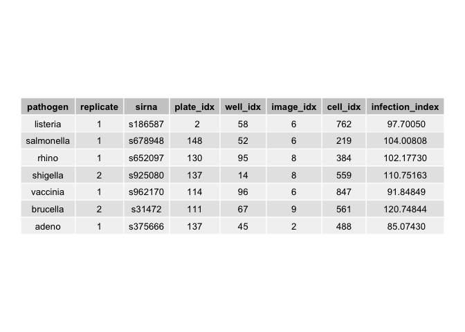

    data[, .SD[sample(.N, 1)],
         by=c("pathogen"),
         .SDcols=c("replicate", "sirna", "plate_idx", "well_idx",
                   "image_idx", "cell_idx", "infection_index")] %>%
      tableGrob(rows=NULL, theme = ttheme_default(base_size=10)) %>%
      grid.arrange

